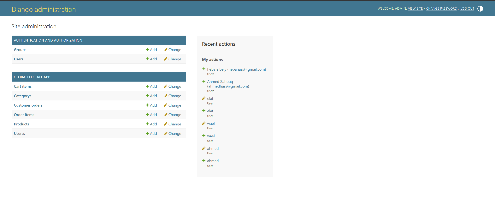
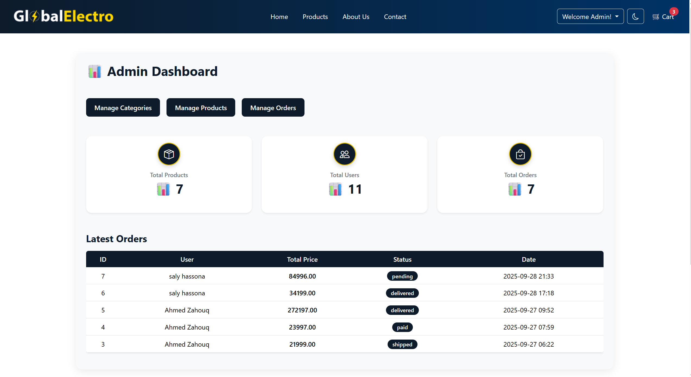
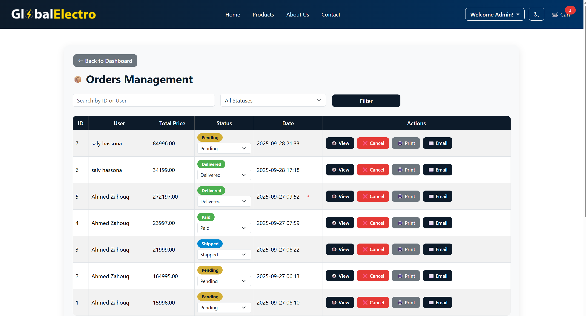
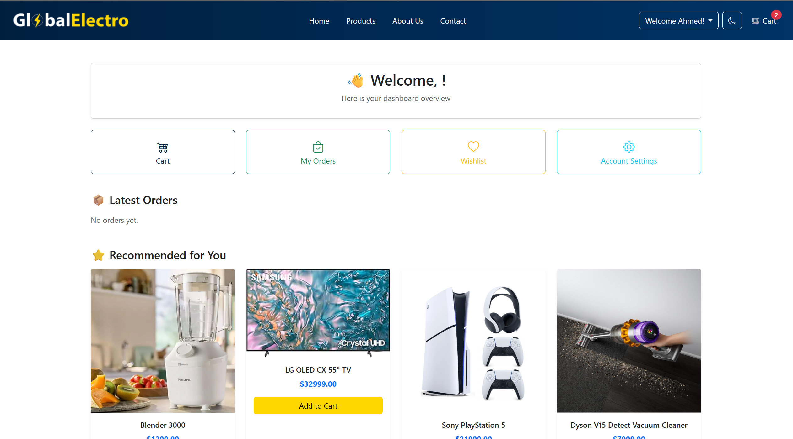
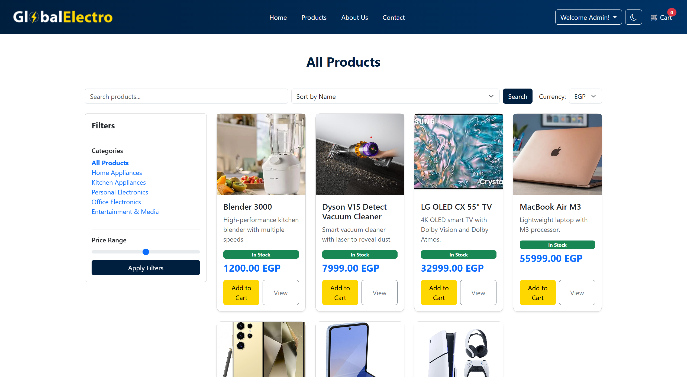
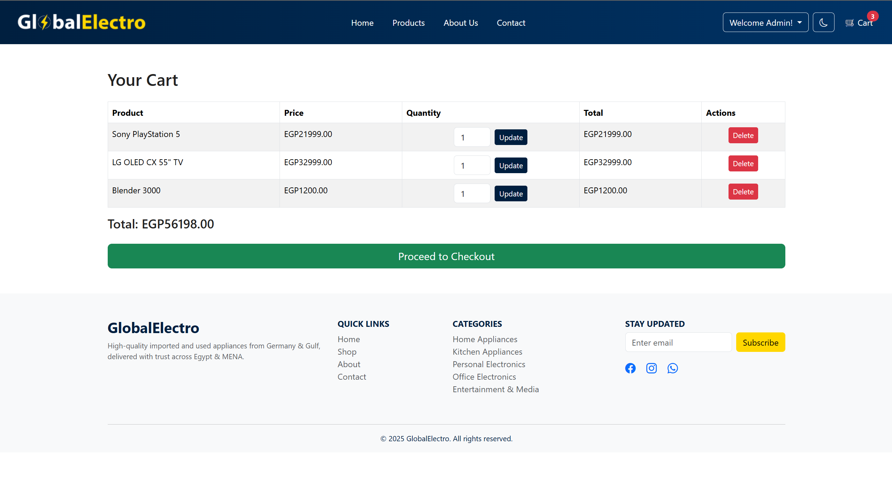

# 🌐 GlobalElectro

[Visit Live Site 🌟](http://54.146.200.53/)

**Innovative E-commerce Platform for Electronics & Appliances**  
*Tagline: High Quality – Affordable – User-Friendly*

---

## 📌 Project Overview

**GlobalElectro** is a cutting-edge E-commerce platform offering **high-quality used and imported electronics and appliances** from Germany, Gulf countries, and beyond to customers in **Egypt and the MENA region**.

**Key Features:**
- ✅ High-quality products at **affordable prices**
- ✅ **Secure, responsive, and user-friendly** marketplace
- ✅ Future: **community-driven platform** where users can list their own items

---

## 👥 User & Admin Interfaces

### 1️⃣ Super Admin (Django Admin)
- Full management of users and other admins
- Control over products, categories, and orders

### 2️⃣ Inventory/Admin
- Product & inventory management
- Track inventory-related orders
- Cannot manage other users

### 3️⃣ Customer
- Register & log in
- Browse products by categories
- Add items to cart & place orders
- Track past orders and their status

---

## 🛒 Product & Shopping System

**Product Categories:**
- Home Appliances
- Kitchen Appliances
- Personal Electronics
- Office Electronics
- Entertainment & Media

**Functionalities:**
- Filter by price, category, and condition (New / Used)
- Dynamic total price calculation in the cart using **AJAX**
- Real-time updates for cart and products without full page reloads

---

## 📦 Order Management

- Add, update, or remove items from the cart using **AJAX calls**
- Orders generated automatically upon checkout
- Track past orders and their status in real-time

---

## 🎨 UI/UX Design

- Fully **responsive design** using Bootstrap
- **Intuitive and user-friendly** interface
- Modern, clean aesthetics for a seamless shopping experience

---

## 🔒 Security & Authentication

- **Secure user authentication** with password hashing
- **CSRF protection** on all forms
- Input validation to prevent **SQL injection** and other vulnerabilities

---

## ⚡ AJAX & API Integration

- **Dynamic Product Loading:** Products update without page reloads  
- **Cart & Checkout:** Add/remove items via AJAX calls to API endpoints  
- **Real-time Order Tracking:** Customers see order status instantly  
- **Seamless User Experience:** Faster interactions and smooth browsing

---

## 🚀 Future Scope

- Allow users to **list and sell their own used devices**
- Implement **reviews & rating system** for buyers and sellers
- Integrate **secure online payment gateway**

---

## 🏁 Conclusion

**GlobalElectro** combines quality, affordability, security, and user-friendliness to deliver a comprehensive marketplace for **Egypt and the MENA region**.  

Empowering users to **buy and sell electronics seamlessly**.

---

## 🛠 Tech Stack

- **Backend:** Django  
- **Frontend:** Bootstrap, HTML/CSS, JavaScript  
- **Database:** MySQL  
- **AJAX / API Integration:** Dynamic product updates, cart, and order management without full page reloads  
- **Security:** CSRF protection, password hashing, input validation
